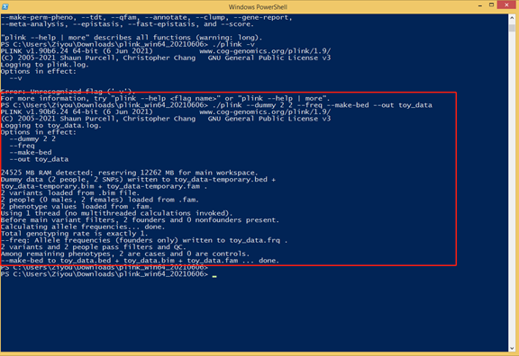

# Summary for 10-19-2021 meeting

## In today's meeting, we discussed:

* the syntax fo markdown file. e.g.
    * how to divide section and make headers
    * how to insert [link](http://www.google.com) or link for the [file](resources/R_requirement.txt)
    * how to insert png or pdf figure 
    
    * how to make **bold** or _italic_
    * how to make list of bullet points

* the plan to make a markdown file for our GWAS project.
    * We will follow similiar format as a project paper but use markdown file.
    * You will work on the introduction and background for GWAS using the paper I shared or your own google search.
    * You can insert some pictures and tables into the introduction.

* the plan to use (Plink)[https://www.cog-genomics.org/plink/] as one of the major software
    * Plink can be installed on the PC. Please follow the steps:
        1. Install Windows powershell into your PC. The details are on [Windows website](https://docs.microsoft.com/en-us/powershell/scripting/install/installing-powershell-on-windows?view=powershell-7.1)
        2. Download and unzip the appropriate plink package for your system from [plink website](https://www.cog-genomics.org/plink/).
        3. Go to the plink folder in the windows powershell command line.
        4. Run the following code to test if the installation is completed:
        ```
        ./plink --dummy 2 2 --freq --make-bed --out toy_data
        ```
        You should see results like:
        