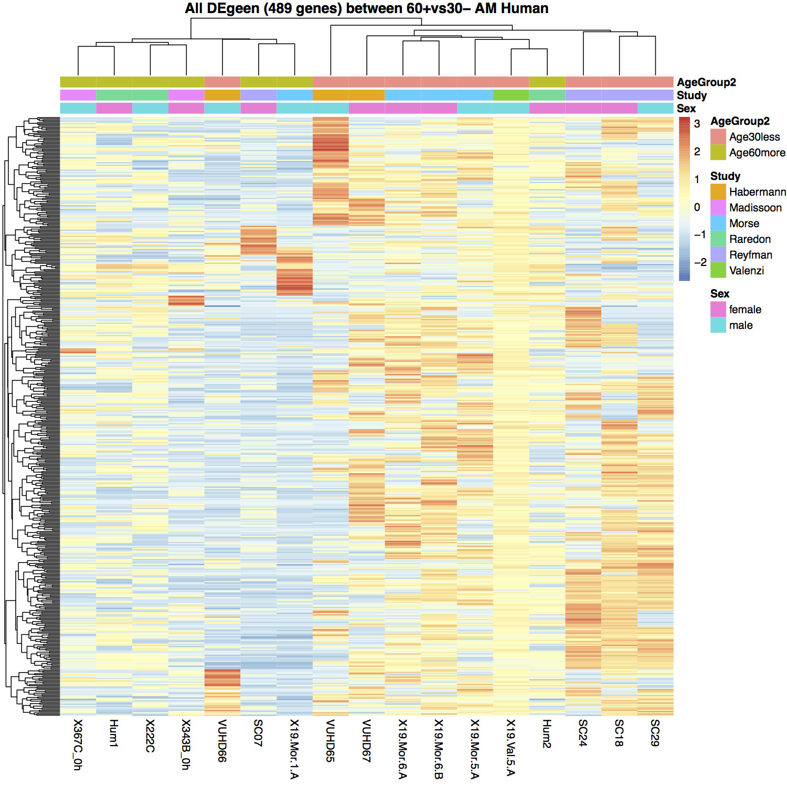

**Further cleaning:**

we could additionally clean up our dataset by removing clusters 2 (CCL3 and CCL4 cluster),5 (epithelial genes cluster),6 (MoAM cluster) from above object and perform DE analysis. In this case, there were even fewer upgenes in aging (66) and the down genes were similar (423). The trend was similar between <30 and >60 groups.

## Versioning

We use Seurat V3.1.2 and edgeR V3.20.9 under R V3.5.1 on Northwestern High Performance Computing Cluster. Detail session info can be found [here](http://www.google.com).

